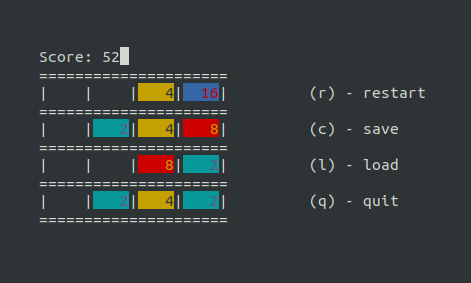

# 2048

Clone of [2048](https://en.wikipedia.org/wiki/2048_(video_game)) in the terminal.

## Ubuntu
### Installation
```bash
sudo apt-get install libncurses5-dev libncursesw5-dev
make
```

## Usage
```bash
./play
```
Alternatively, grid dimension can be modified
```bash
./play 8
```

## Screenshot
