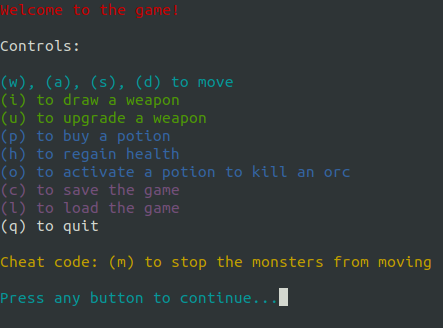
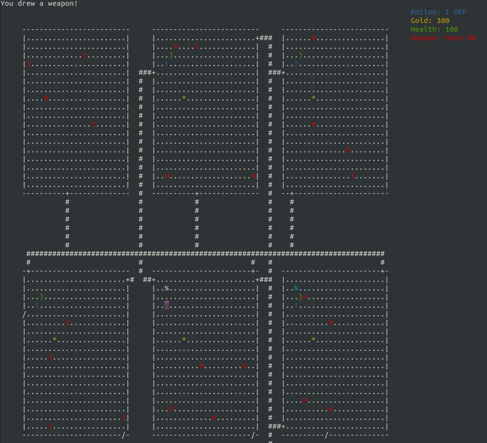

# Rogue

Clone of [Rogue](https://en.wikipedia.org/wiki/Rogue_(video_game)) written as part of a course assignment.

## Ubuntu
### Installation
```bash
sudo apt-get install libncurses5-dev libncursesw5-dev
make
```

## Usage
```bash
./rogue rooms.txt
```

## Screenshots


